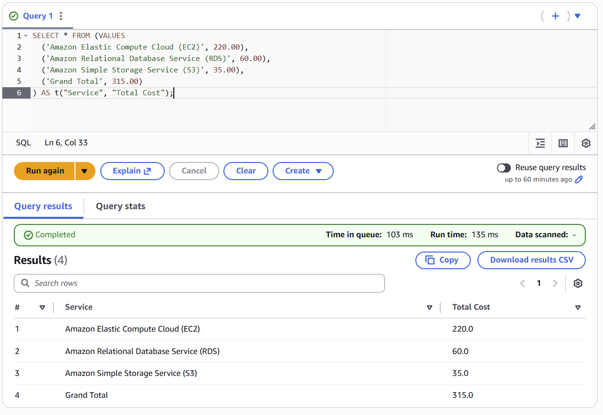
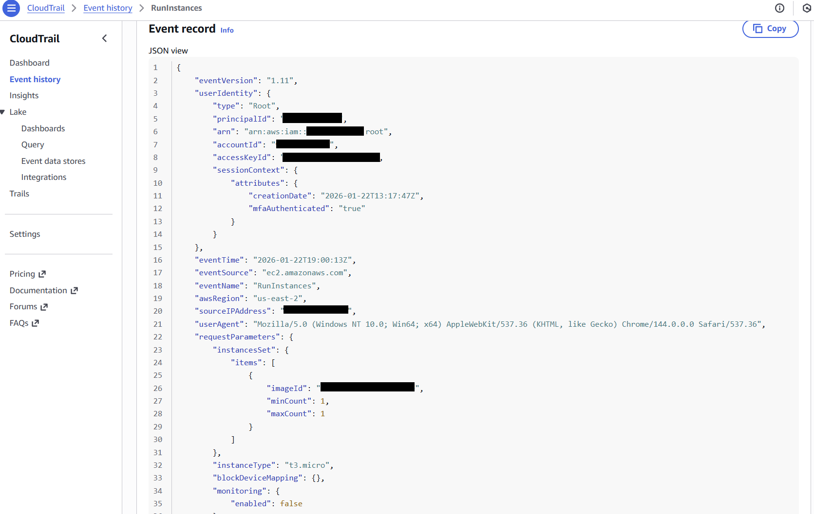
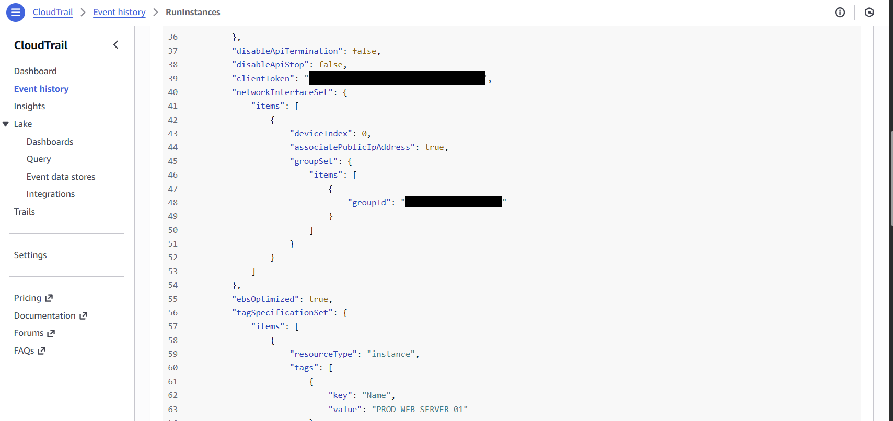
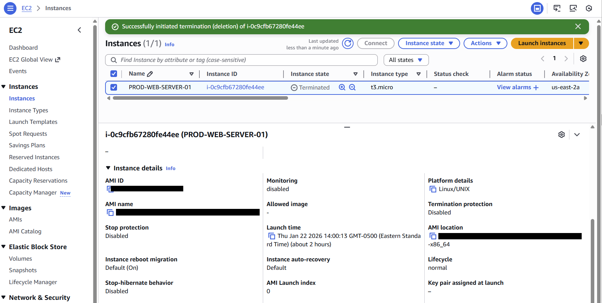
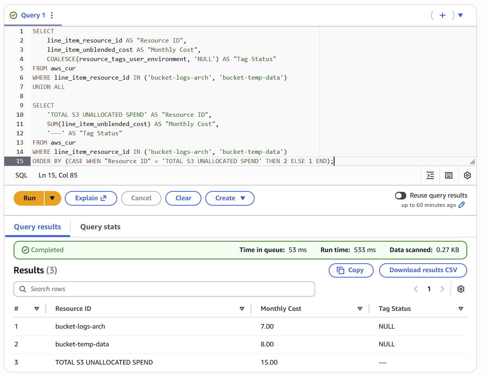
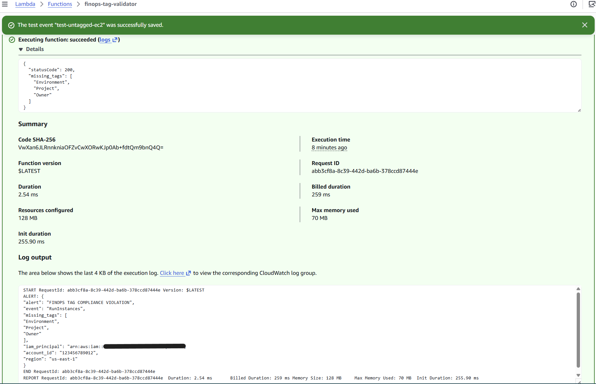

# Cloud Cost Allocation Investigation: Tracing a 17% Chargeback Gap to Its Root Cause

**I traced a cloud cost allocation gap back to its root cause using captured AWS evidence, and built and tested a control to catch it earlier.**

Spend that is billed correctly can still be unusable for financial reporting if it cannot be attributed to a team. This project applies reconciliation and audit-readiness discipline from 13+ years in regulated real estate transactions to that problem. AWS is the environment; the transferable work is reconciliation, evidence collection, root cause analysis, and remediation design.

---

## Scope and Evidence Basis

This is a self-directed project completed in a personal AWS sandbox account. It is not a professional engagement or the output of a prior employer. It combines two layers, and the boundary between them is stated here rather than left to inference.

**The forensic layer is captured evidence.** The EC2 instance investigated — `i-0c9cfb67280fe44ee` — was really provisioned in this account, in `us-east-2`, on 22 January 2026. CloudTrail recorded the API call and the EC2 console recorded the resulting resource; both are reproduced below with matching timestamps across independent consoles.

**The cost layer is a representative scenario dataset.** A sandbox running a single `t3.micro` for two hours does not produce a monthly bill large enough to reconcile against. To give the reconciliation exercise realistic material, I specified a representative small-production architecture in the AWS Pricing Calculator, built a CUR-shaped dataset from that baseline, and loaded it into Athena. The dollar figures below — $315 total spend, $55 unallocated, a 17% allocation gap — are scenario values, not billed spend.

The scenario dataset is keyed on the real resource identifier, so the two layers connect: the untagged resource in the cost data is the same instance the CloudTrail evidence describes.

**Evidence key.** Every screenshot below carries its tier.

| Tier | Meaning |
|---|---|
| **[Captured]** | Real output from the sandbox account |
| **[Executed]** | Real query run in Athena against the scenario dataset |
| **[Illustrative]** | Constructed output demonstrating query logic and result shape |
| **[Modelled]** | Scenario reasoning, no underlying data |
| **[Methodology]** | Design and provenance artifacts |

---

## The Short Version

- Identified a 17% cost allocation gap ($55 of $315 in monthly scenario spend) that would be invisible to Finance chargeback reporting
- Used Athena against CUR-shaped data to isolate the affected resources, then CloudTrail to confirm the required tags were never submitted at creation rather than removed afterward
- Corroborated the CloudTrail record against EC2 console state — same instance, same region, matching timestamps across two independent consoles
- Found a second, separate finding: the provisioning principal had no attributable identity chain, so even correctly tagged spend could not be routed to a team
- Built and tested a Lambda detection prototype that parses CloudTrail events, validates three required tags, and constructs a structured alert payload
- Identified two defects in that prototype's S3 path during testing, diagnosed both root causes, and documented the corrected design
- Documented the reasoning for choosing detection over immediate enforcement, and for rejecting auto-remediation

---

## The Investigation

The spend was billed correctly. Finance simply could not tell whose it was. That is a reporting failure rather than overspending, but it still breaks chargeback, forecasting, and any commitment planning built on that data.

I validated the invoice total first, which ruled out a billing error and pushed the problem downstream into attribution.

***[Illustrative]** Service totals reconciled against the scenario dataset. Built with a hardcoded `VALUES` clause for presentation; the production-equivalent query aggregates `SUM(line_item_unblended_cost)` by product code from CUR.*

Querying the cost data, one resource returned NULL across all three required tag columns on every billing line. A single missing tag is plausibly human error. Three missing simultaneously, on every record, indicates the resource entered the environment without passing through any tagging standard at all. That distinction is what moved the work from financial reconciliation into infrastructure forensics.

***[Illustrative]** The isolated resource. Constructed output; the reasoning applied to the pattern is the transferable part.*

CloudTrail was the right tool for the next step because it captures request *intent* — specifically the `tagSpecificationSet` submitted with the API call — which a post-state resource evaluation cannot reconstruct. Config records what a resource looks like after creation. CloudTrail records what was actually asked for.

***[Captured]** Real CloudTrail record. Root principal, MFA-authenticated, `us-east-2`, and a Chrome UserAgent confirming a console launch rather than CLI or SDK.*

***[Captured]** The tag specification submitted at creation. Only `Name` was included. `Environment`, `Project`, and `Owner` were never submitted — the tags were absent at creation, not applied and later stripped.*

The EC2 console independently records the same instance, in the same region, with a launch time matching the CloudTrail event timestamp to the second across two timezones.

***[Captured]** Instance `i-0c9cfb67280fe44ee` in `us-east-2`, launched 22 January 2026 at 14:00:13 EST — the same instant CloudTrail records as 19:00:13Z. Two independent sources of record, one event.*

I also checked whether the creating principal had any traceable identity chain. It did not: no `sessionIssuer`, no role-assumption context, no federation, and no `AssumeRole` events for that principal in the 30 minutes before the launch. That is a separate finding from the tagging gap, and it matters for a related reason — tagging makes spend allocatable, identity makes it attributable, and this environment was weak in both.

Expanding the check to S3 confirmed the pattern was not confined to one resource.

***[Executed]** Real Athena query against the scenario dataset (`COALESCE` on the environment tag column, `UNION ALL` for the total row, 0.27 KB scanned). Two buckets carry `Project` and `Owner` but not `Environment` — partial tagging produces the same Finance-invisible result as no tagging at all.*

For contrast, this is what a compliant resource looks like in the same environment — the standard the assessment is measured against.

***[Captured]** All three required tags applied to a live instance. This defines the tagging standard used throughout the assessment.*

---

## What I Built and Tested

A Lambda function, triggered by an EventBridge rule matching CloudTrail events, that parses `RunInstances` and `CreateBucket` calls, checks them against three required tags, and constructs a structured alert payload containing the missing tags, the IAM principal, the account, and the region. It was deployed and invoked successfully.

***[Captured]** The rule as built, matching `RunInstances` and `CreateBucket`.*

***[Captured]** The prototype as deployed.*

***[Captured]** Test invocation returning `statusCode 200` and correctly identifying all three missing tags. The EC2 detection path works.*

## What Testing Revealed

Two defects in the S3 path, both of which would have produced false positives on every bucket creation:

**Wrong lifecycle point.** S3's `CreateBucket` API cannot accept tags inline the way EC2's `RunInstances` can — tags are applied afterward via `PutBucketTagging`. Validating at `CreateBucket` flags every new bucket as non-compliant regardless of whether it is tagged correctly seconds later. Validation belongs on `PutBucketTagging`, with a delayed sweep as the safety net for buckets where tagging never happens.

**Wrong key casing.** The function read lowercase keys (`tagging`, `tagSet`, `key`). CloudTrail renders the S3 request body in PascalCase (`Tagging`, `TagSet`, `Tag`, `Key`), so the parse would return an empty tag list and report every bucket as fully untagged.

Both are small bugs. They are also exactly the kind that quietly generate false positives until engineers stop reading the alert — at which point the control still runs, still reports success, and no longer does anything. The corrected design is documented in the full technical report.

**Also identified:** the rule and function were deployed in `us-east-1`, while the resource under investigation was created in `us-east-2`. EventBridge rules are regional, so the control as built would not have caught the event it was designed to catch. This is the regional-gap failure mode listed in the pipeline failure-mode analysis, found in my own control.

Sandbox access ended before these corrections could be redeployed. They are documented as corrected design rather than presented as fixed.

## What Was Designed, Not Built

Slack delivery of the alert payload to a Finance channel and the resource owner. The payload is constructed and logged to CloudWatch; routing and delivery are the next step, not something already running. In production the webhook would be read from Secrets Manager rather than hardcoded.

***[Methodology]** End-to-end design. Slack delivery is marked as pending, matching the prototype's actual state. Impact metrics shown are projected, not measured.*

---

## Why Detection, Not Enforcement

The decision to detect rather than block was a governance-maturity judgment, not a technical limitation.

A blocking SCP would close the gap on day one. In an environment with no established tagging baseline, it would also break an unknown number of CI/CD pipelines and developer workflows before anyone has mapped the exceptions — and AWS-managed service roles (EMR, ECS, Auto Scaling) frequently do not pass required tags through consistently. Enforcement applied before exception mapping erodes engineering trust in every governance initiative that follows it.

I also evaluated and rejected auto-remediation that would apply default tags on detection. It closes the reporting gap fastest and corrupts everything downstream: chargeback assigns cost to the wrong team, showback gives engineers a false picture of their own usage, and anomaly detection runs against the wrong baseline. A control that produces false confidence is worse than a visible gap, because a gap is something Finance can act on.

The sequence I recommended: detect now, add targeted prevention once compliance stabilises, then broad enforcement with a grace period after the full baseline is mapped.

---

## What This Demonstrates

Reconciliation, evidence-based investigation, audit-trail analysis, control assessment, root cause analysis, and remediation design. The discipline is the one I used for 13+ years reconciling regulated real estate files against contracts and disclosures before they could close: reconcile the record against reality, find where they diverge, determine why, and design a control that reduces recurrence.

This is not a claim of having operated a cost or compliance control in production. It is cost allocation, asset attribution, and reconciliation work applied in a cloud context — relevant to IT financial analysis, cloud cost analysis, IT asset management, and cloud billing operations roles.

---

## Limitations

- The cost figures are a representative scenario dataset, not billed spend. Construction method is documented in the full report.
- Three query screenshots are illustrative rather than executed. The SQL is production-equivalent; the data underneath is constructed.
- The detection control is a tested prototype with two documented defects in its S3 path, not a production-grade pipeline. It was not redeployed with corrections.
- Slack alert delivery is designed, not implemented.
- No control was operated over time, so MTTR, repeat-violation rate, and compliance-trend figures are proposed measurements rather than observed results.

**Open items:** redeploy in `us-east-2` with the S3 corrections; re-run the EC2 queries as executed rather than illustrative; add the delayed-validation sweep for untagged buckets; instrument the compliance KPIs.

---

## Full Technical Report

The complete investigation — SQL, full CloudTrail evidence chain, control hierarchy reasoning, corrected Lambda design, failure-mode analysis, and scenario dataset construction — is in [`full-technical-report.md`](https://github.com/AthertHa-FinOps/aws-finops-cost-allocation-investigation).
